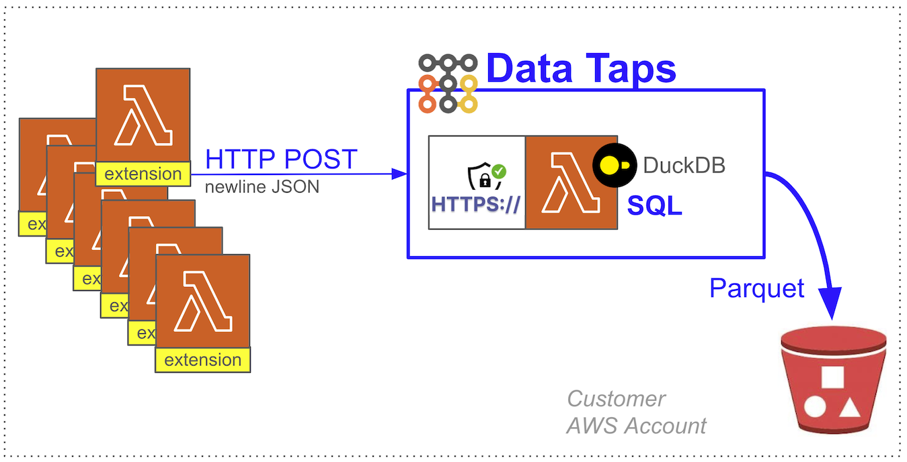

[FluentBit](https://github.com/boilingdata/data-taps-fluentbit-example) | [Web Analytics](https://github.com/boilingdata/data-taps-webanalytics-example) | [PostgreSQL CDC](https://github.com/boilingdata/data-taps-postgres-cdc) | [REST API](https://github.com/boilingdata/data-taps-nycopendata-example) | [OpenSearch/ES](https://github.com/boilingdata/data-taps-opensearch-to-s3) | [AWS Lambda Telemetry](https://github.com/dforsber/data-taps-lambda-extension)

# AWS Lambda Logs (Telemetry API) --> Data Tap --> S3

<p align="center">
  
</p>

[AWS Lambda Extension](https://docs.aws.amazon.com/lambda/latest/dg/lambda-extensions.html) that uses the [Lambda Telemetry API](https://docs.aws.amazon.com/lambda/latest/dg/telemetry-api-reference.html) to forward logs to a [Data Tap HTTPS URL](https://www.taps.boilingdata.com/).

> NOTE: This is forked from the [Logtail Lambda Extension](https://github.com/stockstory/logtail-lambda-extension) and optimised for [Boiling Data Taps](https://www.taps.boilingdata.com/) ingestion.

## Data Tap

A Data Tap is a single AWS Lambda function with [Function URL](https://docs.aws.amazon.com/lambda/latest/dg/lambda-urls.html) and customized C++ runtime embedding [DuckDB](https://www.duckdb.org/). It uses streaming SQL clause to upload the buffered HTTP POSTed newline JSON data in the Lambda to S3, hive partitioned, and as ZSTD compressed Parquet. You can tune the SQL clause your self for filtering, search, and aggregations. You can also set the thresholds when the upload to S3 happens. A Data Tap runs already very efficiently with the smallest arm64 AWS Lambda, making it the simplest, fastest, and most cost efficient solution for streaming data onto S3 in scale. You can run it on [your own AWS Account](https://github.com/boilingdata/data-taps-template) or hosted by Boiling Cloud.

You need to have [BoilingData account](https://github.com/boilingdata/boilingdata-bdcli) and use it to create a [Data Tap](https://github.com/boilingdata/data-taps-template). The account is used to [fetch authorization tokens](https://github.com/boilingdata/data-taps-template?tab=readme-ov-file#3-get-token-and-ingestion-url-and-send-data) which allow you to send data to a Data Tap (security access control). You can also share write access (see the `AUTHORIZED_USERS` AWS Lambda environment variable) to other BoilingData users if you like, efficiently creating Data Mesh architectures.

# Run

In order to use the extension you must first build and deploy it into your AWS infrastructure:

```shell
$ git clone git@github.com:dforsber/data-taps-lambda-extension.git
$ cd data-taps-lambda-extension
$ yarn install
$ yarn build
$ aws lambda publish-layer-version \
      --layer-name "data-taps-lambda-extension" \
      --zip-file "fileb://./dist/extension.zip" \
      --compatible-runtimes nodejs20.x \
      --compatible-architectures x86_64 arm64
```

Once deployed set the `BD_TAP_CLIENT_TOKEN` environment variable on your Lambda to your [Data Tap client token](https://github.com/boilingdata/boilingdata-bdcli), and [add the layer](https://docs.aws.amazon.com/lambda/latest/dg/invocation-layers.html) to your Lambda function. Set the `BD_DATA_TAP_URL` as your Data Tap URL. On next invocation your Lambda logs should start flowing to your configured Data Tap. There is buffering on both in the Lambda Extension and in the Data Tap.

> NOTE: You can have multiple Data Taps. It's better to use multiple Data Taps if you have differing schemas.

## Environment Variables

| Variable                                 | Description                                             | Default                              |
| ---------------------------------------- | ------------------------------------------------------- | ------------------------------------ |
| BD_TAP_CLIENT_TOKEN                      | Data Taps client token                                  | **required**                         |
| BD_DATA_TAP_URL                          | Data Tap URL                                            | **required**                         |
| EXTENSION_NAME                           | Name of the lambda extension                            | `data-taps-lambda-extension`         |
| RECEIVER_ADDRESS                         | Address of the logs http receiver                       | `sandbox`                            |
| RECEIVER_PORT                            | Port of the logs http receiver                          | `4243`                               |
| MAX_ITEMS                                | Maximum number of events that can be buffered in memory | `10000`                              |
| MAX_BYTES                                | Maximum size in bytes of events that can be buffered    | `262144`                             |
| TIMEOUT_MS                               | Maximum time (in milliseconds) that a batch is buffered | `1000`                               |
| AWS_LAMBDA_RUNTIME_API                   | HTTP base URI to the lambda runtime API                 | _Provided by AWS Lambda environment_ |
| AWS_LAMBDA_RUNTIME_EXTENSION_API_VERSION | Lambda Extension API version date                       | `2020-01-01`                         |
| AWS_LAMBDA_RUNTIME_TELEMETRY_API_VERSION | Telemetry API version date                              | `2022-07-01`                         |
